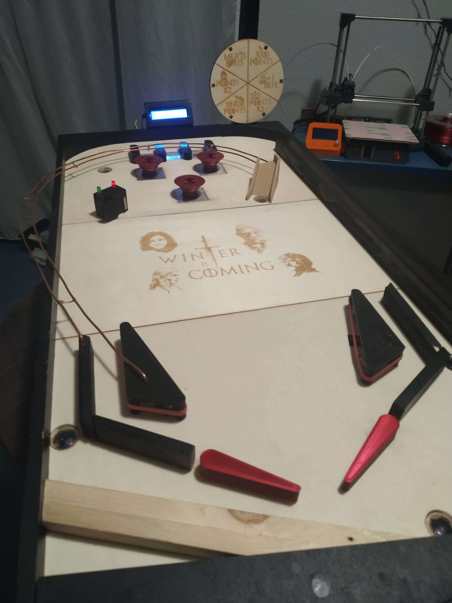

Dans le cadre des cours de robotique de 2ème année de classe préparatoire intégrée à Polytech Nice Sophia. Nous avons conçu et fabriqué un flipper de A à Z entièrement contrôlé par une carte Arduino.  

Ce GitHub rassemble nos rapports d'avancée hebdomadaire ainsi que tous les fichiers créés pour concevoir ce flipper.

**Vidéo de présentation du projet** : https://youtu.be/dcDQBHgphmI

Cette première version a dû être réalisée dans un délai très court (moins de 3 mois) en pleine année scolaire. Ainsi nous avons du nous focaliser sur l'essentiel, mais ce projet a été conçu dès le début pour être évolutif et bénificiera d'améliorations prochainement.

Projet réalisé par Abderrahmane Redha et Waeles-Devaux Adrien.
