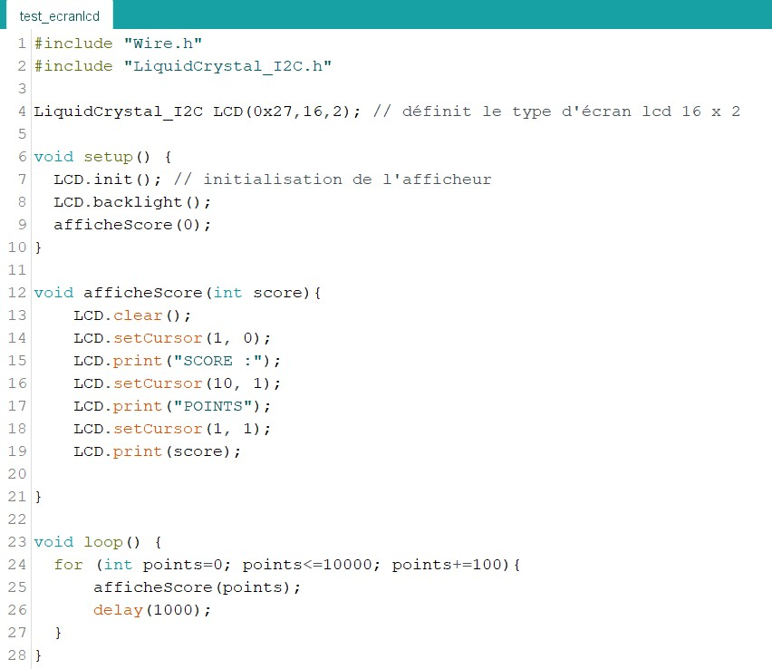
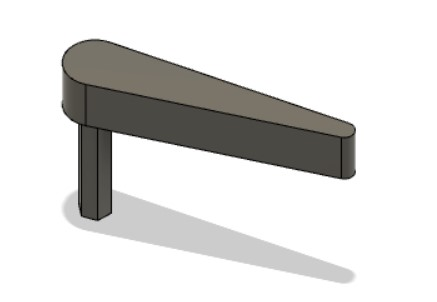
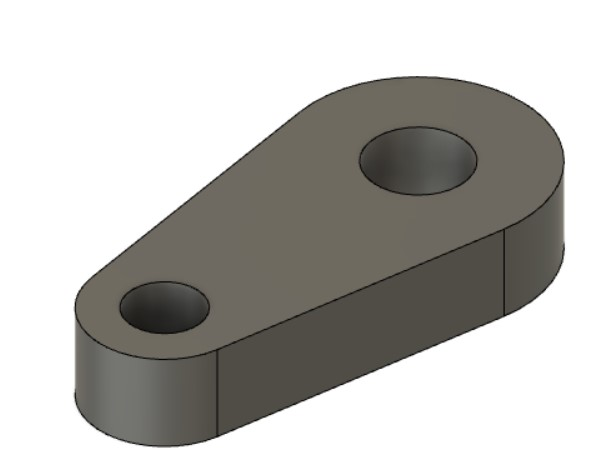
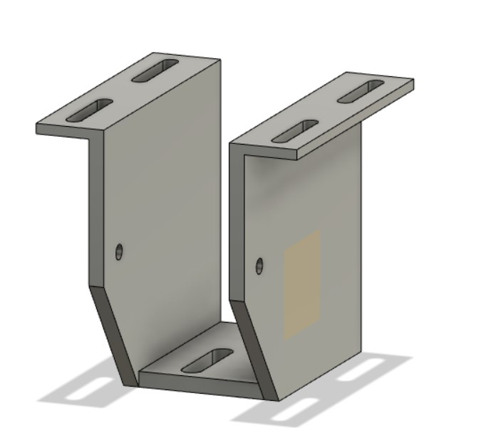
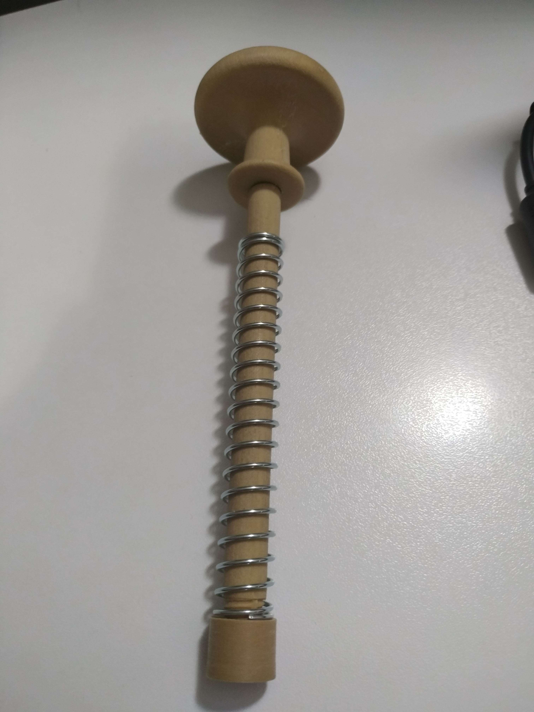

**Avant la séance :**

Tout d’abord j’ai pu tester l'écran LCD afin d'afficher des messages et d'actualiser le nombre de points. L'écran est branché à un module I2C ainsi il ne suffit que de 2 câbles de communication branchés aux entrées analogiques de l'arduino en plus de son alimentation: (sur une carte Arduino Uno la broche SDA est connectée au port analogique A4 de la carte et la broche SCL au port A5). Au début l’écran ne semblait pas fonctionner, aucun message ne s'affichait, mais il suffisait de tourner la petite vis au dos pour ajuster le contraste. Voici un programme simple de test :

La fonction affiche Score(int score) permet d’afficher simplement n’importe quel score à l’écran. Elle est appelée dans le void setup avec la valeur 0 car toute partie commence avec 0 points. Pour effectuer des tests j’ai écrit une boucle for dans le void loop qui incrémente un nombre de points de 100 toutes les secondes jusqu'à 10000. Cette fonction pourra être optimisée par la suite.

Pendant les vacances de Noël, j’ai travaillé sur la fabrication des flippers. Pour les modéliser j’ai utilisé les dimensions réelles d’un flipper. J’ai décidé de diviser le mécanisme en 3 pièces : le flipper qui est la pièce frappant la balle muni d'une tige hexagonale qui vient s'emboîter dans la pièce suivante.

La 2ème pièce est un “bras” de flipper, elle est située sous la planche et va permettre de transformer le mouvement de translation du solénoïde en mouvement de rotation. Elle est reliée au flipper par une 3ème pièce qui tourne autour de son axe.

La 3eme pièce permet de relier le solénoïde au bras du flipper.
Pour cela j'insère cette 3eme pièce dans la 2eme en effectuant une pause dans l'impression 3d pour que cette pièce soit prisonnière dans la 2eme et puisse tourner autour.  Cela permet d’éviter l’ajout de vis supplémentaires. Cette pièce est essentielle car je ne pouvais pas attacher directement le solénoïde qui se déplace linéairement à une pièce qui effectue un mouvement de rotation.

Voici une vue de dessous la planche de l’ensemble solénoide + attache_bras + bras de flipper : 

J’ai également modélisé une équerre permettant de fixer le solénoïde sous la planche. J'ai rencontré des difficultés pour placer correctement le solénoïde, en effet celui-ci doit être positionné précisément pour que l’axe de la pièce imprimée en 3d soit bien droit, sans cela le solénoïde se bloque et ne revient pas en position initiale grâce à son ressort. Afin de régler le positionnement du solénoïde plus facilement j’ai décidé de remplacer les trous circulaires sur la modélisation de l’équerre pour les remplacer par des rainures. Il suffira alors d’utiliser des rondelles sous les vis pour s’assurer que la pièce soit fixe. Ainsi je peux désormais monter ou descendre le solénoïde sur la planche en déplaçant les vis dans les rainures. J'ai pu alors fixer le solénoïde sur la planche en y perçant un trou et en fixant l'équerre. 
https://youtube.com/shorts/JcDkgeMB18o?feature=share

J’ai ensuite ajouté une encoche circulaire dans la pièce de modélisation du bumper sur Blender qui permet d'y insérer un fil électrique sur lequel la bille va faire contact. J'ai également dû modifier la hauteur de la pièce pour que la bille soit bien en contact avec la planche et le fil du bumper. 

Comme expliqué dans les comptes rendus précédent le slingshot (pièce dotée d'un élastique qui va renvoyer la bille dans la zone de jeu en tendant l'élastique)  ne renvoyait pas la bille assez fort en raison de la faible course du solénoïde utilisé (10mm) et de sa force peu élevée (8 Newtons). 
Suite aux conseils de nos professeurs, j’ai complètement repensé le modèle 3d du slingshot pour y intégrer un système de levier. Celui-ci permet d’avoir une plus grande amplitude de mouvement. Le levier aura donc une course plus grande et une force plus élevée. Pour cela j’ai d’abord réalisé un prototype dans lequel j’ai réalisé plusieurs trous pour tester l’emplacement optimal de la barre sur laquelle le levier va effectuer son pivot et pour déterminer la longueur du levier. Voici le résultat après de nombreux essais et modifications de la pièce imprimée à la lime et à la perceuse:
https://youtube.com/shorts/K7FTkk97wYo?feature=share

J’ai finalement remodifié la pièce imprimée en tenant des compte des améliorations effectuées pour avoir une pièce propre que je puisse réimprimer également pour le 2ème slingshot. Voici l’équerre du solénoide du slingshot modélisée ainsi que le levier :

Etant donné qu’il il a fallu passer un temps énorme sur les prototypes du slingshot, bumper et du flipper pour créer les pièces aux bonnes dimensions et surtout les placer correctement sur la planche. J’ai décidé de créer une maquette en 3D du pinball sur Sketchup afin d’avoir toutes les mesures nécessaires et gagner en temps et précision pour l’installation des composants sur la planche finale et la réalisation des gravures, perçages et le découpage des bordures. Pour cela j’ai effectué de nombreuses mesures en me basant sur les différents prototypes réalisés lors des séances précédentes et sur des recherches de schémas pour déterminer la position exacte de chaque composant en vérifiant que la bille puisse atteindre tous les éléments sans se coincer. J’ai donc importé toutes les pièces précédemment modélisées afin de les placer. Il reste encore quelques éléments qui seront ajoutés bientôt à la maquette.

J’ai également profité de ces vacances pour terminer la modélisation de la poignée sur blender, afin d’avoir une poignée adaptée à notre flipper et qui permette une bonne prise en main.  Cette poignée est liée à une tige autour de laquelle on y place un ressort. Cependant l’imprimer avec sa tige en une seule pièce aurait nécessité beaucoup de support à l’impression. J’ai donc divisé la pièce en 3 parties avec filetage pour éviter supports et cela permet également d’insérer la tige dans son futur support sur la planche afin que le ressort soit coincé entre le rebord de la planche et la pièce plastique visée au bout de la poignée. Le filament utilisé est du PLA imitation bois d’où la forte ressemblance avec du bois. Voici les pièces modélisées imprimées en 3D avant montage :

Et voici le tout assemblé (sans utiliser de vis ou de colle puisque tout se visse parfaitement grâce aux filetages).

Cette poignée m’a demandé beaucoup de temps car Fusion 360 nécessite n’est pas très adapté pour traiter des maillages avec beaucoup de points. J’ai donc dû faire le filetage à part puis l’importer dans blender pour l’insérer dans la poignée en comblant les trous dans la géométrie de la pièce. J’ai également appris à créer des filetages sur Fusion 360 pour la première fois. En effet, pour que les 2 pièces puissent se visser facilement après impression il est très important de modifier une des 2 pièces comportant le filetage pour y réduire le filetage (d’environ 1mm) car il y a des écarts de précisions entre une pièce usinée et l’impression en 3D.

**Pendant la séance :**

Pour commencer il a fallu découper une planche aux dimensions 414*800 cm qui correspondent à celles définies lors de l’élaboration de la maquette 3d, c’est sur cette planche que seront fixés tous les éléments de jeu. Celle-ci à une épaisseur de 5mm. Cependant comme expliqué dans le compte rendu précédent, pour les bumpers nous avons besoin d’incruster de fines plaques métalliques à ras de la planche (permettant de détecter si la bille est à la fois en contact avec la plaque et le fil électrique du bumper), et notre planche est trop longue pour rentrer entièrement dans la découpeuse laser. Avec les conseils des gérants du FabLab nous avons décidé de coller 3 petites planches de bois d’une épaisseur de 3mm sur la grande planche afin de pouvoir graver chacune des planches au laser pour ensuite venir les coller sur la grande planche les unes à côté des autres.

Pour placer les capteurs infrarouges, nous utilisons une fine plaque de plexiglas posée à ras de la planche grâce à nouveau à une gravure. J’ai donc effectué des tests avec un capteur infrarouge en dessous de la plaque de plexiglas pour vérifier que la bille soit toujours détectée à travers la plaque transparente. Un objet comme notre bille reste détectable à travers cette fine plaque de plexiglas à condition que le capteur soit à ras de la plaque.

Puis nous avons pu déterminer les dimensions de cette plaque en fonction de la position des séparateurs de colonnes (pièces noires en haut du flipper sur la maquette).
Redha a ensuite réalisé un fichier vectoriel svg sur Inkscape graver et perçer des trous dans la partie supérieure du flipper en utilisant les cotations définies dans la maquette 3D sur Sketchup.

J’ai ensuite continué la modélisation de la maquette 3d du  pinball afin d’y dessiner le contour du flipper ainsi que la zone de lancement. Cela permettra de découper des morceaux de bois aux dimensions voulues plus facilement par la suite.
Pour cela je me suis aidé de différents schémas de construction de vrais flippers afin de déterminer une taille optimale de l’arc de cercle permettant de créer les arrondis en haut du flipper qui permettront à la balle de sortir de la zone de lancement pour arriver dans la zone de jeu. Je pense peut être ajouter une pièce permettant de contraindre le chemin de la bille après lancement pour l’envoyer directement sur les bumpers.
J’ai ensuite dessiné la sortie de bille, celle-ci doit permettre de diriger la bille jusqu’à la zone de lancement (juste en haut de la poignée). Etant donné que la sortie de jeu de la bille (située au niveau des flippers) est bien plus basse que l’emplacement de la bille avant lancement (juste au dessus de la tige de la poignée), nous avons décidé d’utiliser un solénoïde pour pousser la bille et l’amener jusqu’à la zone de lancement. Ce solénoïde sera déclenché à chaque sortie de bille (qui sera détectée grâce à un capteur infrarouge).

Finalement j’ai modélisé les pièces qui permettront de tendre l'élastique des slingshots en respectant la forme emblématique que l’on retrouve sur tous les flippers. Voici la modélisation sur Fusion 360 : 

