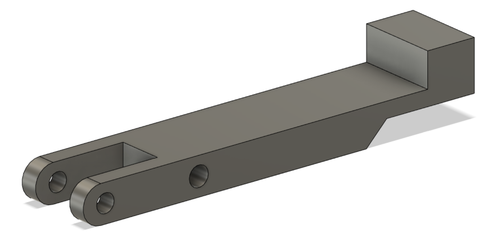
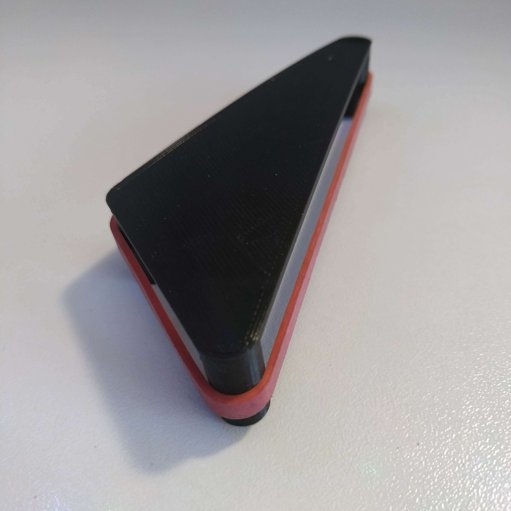

**Avant la séance :**

Nous avons finalisé la réalisation d’un fichier vectoriel en svg sur Inkscape délimitant nos gravures et découpes pour la partie haute du flipper afin d'utiliser une découpeuse laser.

Ces trous permettent notamment de fixer nos bumpers et les gravures en forme de carrés de positionner 3 plaques métalliques à ras de la surface de la planche qui permettront de détecter si la bille roule en dessous d’un bumper. 
Le grand trou rectangulaire permet de positionner une plaque de plexiglass sous laquelle se trouvera un capteur infrarouge permettant de détecter un passage de bille.

Pour rappel, étant donné que notre planche de jeu de dimensions 414 x 800 x 5mm est trop grande pour rentrer dans la graveuse laser directement, nous avions décidé d’y coller dessus 3 petites planches de 3mm afin de pouvoir graver celles- ci. 
Redha s’est occupé de la réalisation des fichiers svg de la partie haute et basse du flipper et je me suis occupé du positionnement des éléments à partir de la maquette virtuelle de notre flipper. 

J’ai ensuite créé un fichier vectoriel pour graver un dessin au milieu du flipper en assemblant des images trouvées en ligne. Pour cela j’ai converti des images en svg puis je les ai importées dans inkscape en les positionnant et en les redimensionnant en fonction de la taille totale de la planche du milieu.

Nous avons décidé de thématiser votre flipper avec pour thème la série Game of Thrones et nous étions donc obligés d’anticiper la décoration par la gravure de cette planche car une fois collée sur la planche épaisse il sera impossible d’effectuer de nouvelles gravures.

Et voici le résultat final de la gravure de la partie haute du flipper avec le positionnement d’une des plaques métalliques : 

J’ai également déterminé la position exacte de tous les éléments en bas du flipper sur notre maquette 3D. 

J’ai ainsi dû adapter le modèle précédent du levier du slingshot (pièce dotée d’un élastique renvoyant la bille en zone de jeu) puisque j'ai constaté que le système de levier prenait trop de place, empêchant l'installation des rangées à gauche et à droite des slingshots. J’ai donc réduit l’épaisseur d’une partie du levier en m’assurant que le levier exerce toujours autant de force sur l’élastique et tout en conservant une pièce rigide. Voici la comparaison entre l’ancienne et la nouvelle modélisation :

Et j’ai également dû modifier la modélisation de la pièce tendant l'élastique du slingshot pour l’agrandir afin d'être sûr que le levier puisse effectuer sa course entièrement sans que l'élastique empêche celui ci de revenir en position initiale, la course du levier est ainsi comprise entre l'avant et l'arrière de l'élastique du slingshot. Voici la pièce finale imprimée en 3D :

Finalement j’ai placé le trou dans lequel le levier va effectuer sa course à travers la planche sur la maquette 3D du flipper.

J’ai également modélisé et imprimé les délimiteurs de rangées : 

**Pendant la séance :**

Certaines parties du contour étant arrondies, il aurait été difficile de les réaliser directement à la main avec précision. Nous avons décidé de réaliser ces parties du contour par découpe laser. Pour cela j’ai utilisé les pièces modélisées sur la maquette 3D, je les ai séparées de la maquette et je les ai exportées en STL. Voici les pièces en question modélisées sur Sketchup.

Ensuite je les ai importées dans Blender pour les transformer en fichiers 2D vectoriels. Pour cela j’ai utilisé l’extension “outline_to_svg” qui permet de faire un rendu 2D d’une pièce en 3D en positionnant une caméra de rendu dans la vue voulue. Il fallait également simplifier la géométrie des différents arrondis pour que le résultat soit exploitable. Et voici le résultat :

Etant donné que la graveuse laser du fablab est limitée à la découpe de planches de 5 mm maximum. Nous allons découper chaque pièce du contour en 4 exemplaires sur des planches de 5 mm. Puis il faudra coller les 4 morceaux de 5mm les uns sur les autres pour avoir une bordure d’une épaisseur totale de 20mm.

J’ai dessiné l'emplacement des différents capteurs infrarouges, pour créer des trous sur la planche afin d'insérer des plaques de plexiglass et Redha les a tracés sur Inkscape. (Les emplacements sont désignés par des cercles sur l'image de la maquette en bas du compte rendu).

Il y en a 5 sur la planche, dont 3 qui sont positionnées aux sorties du jeu, et permettent de détecter si le joueur à perdu la bille. En effet on distingue si la bille sort au centre du flipper (le joueur n’a pas réussi à la réceptionner) et les pertes de billes sur les extrémités du flipper qui ne sont pas la faute du joueur. Cela peut permettre par exemple d’offrir un nouvel essai au joueur si une bille est perdue sans l’intervention du joueur quelques secondes après l’avoir lancée. C’est ce que l’on retrouve sur certains vrais flippers avec le message “bille sauvée” et l’ajout d’un nouvel essai. 

Les deux autres trous sont placés sur la partie haute du flipper, ils sont situés à l’entrée des futures rampes que la bille pourra emprunter.

Finalement j’ai ainsi pu avancer la modélisation de la maquette qui a permis de positionner les éléments à découper et graver au laser.
A gauche de la maquette on peut voir l’assemblage des 3 fichiers vectoriels que nous avons réalisés et qui ont permis d’effectuer les gravures et perçages dans nos 3 fines planches.

