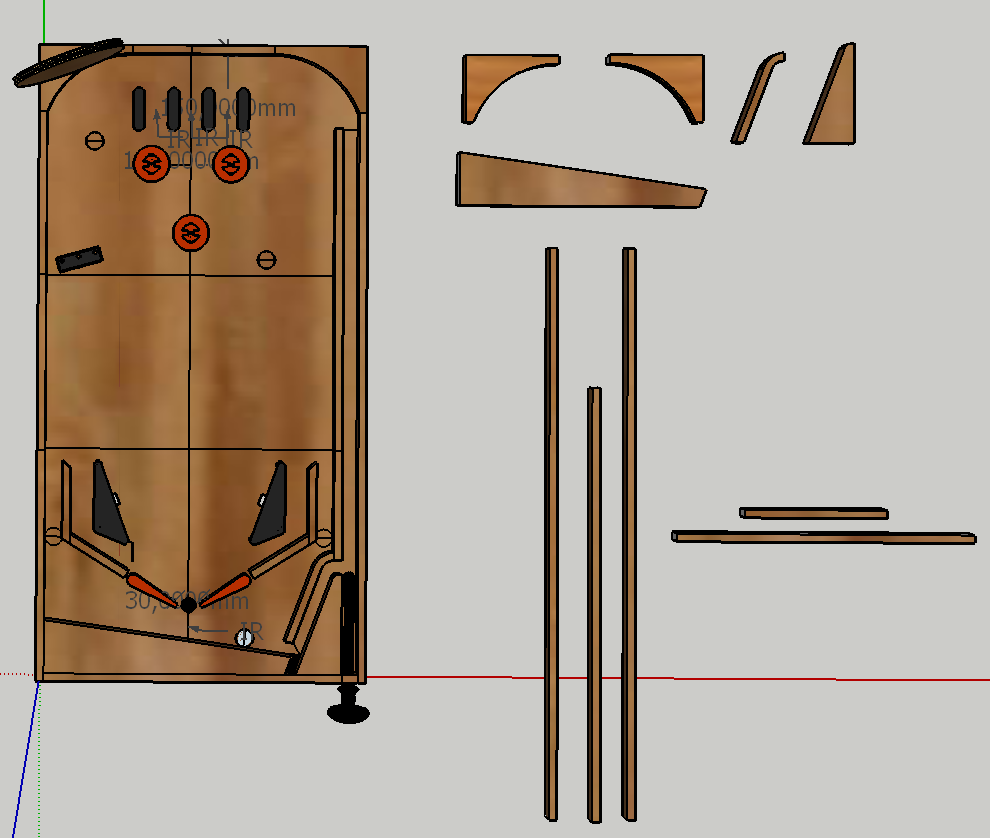
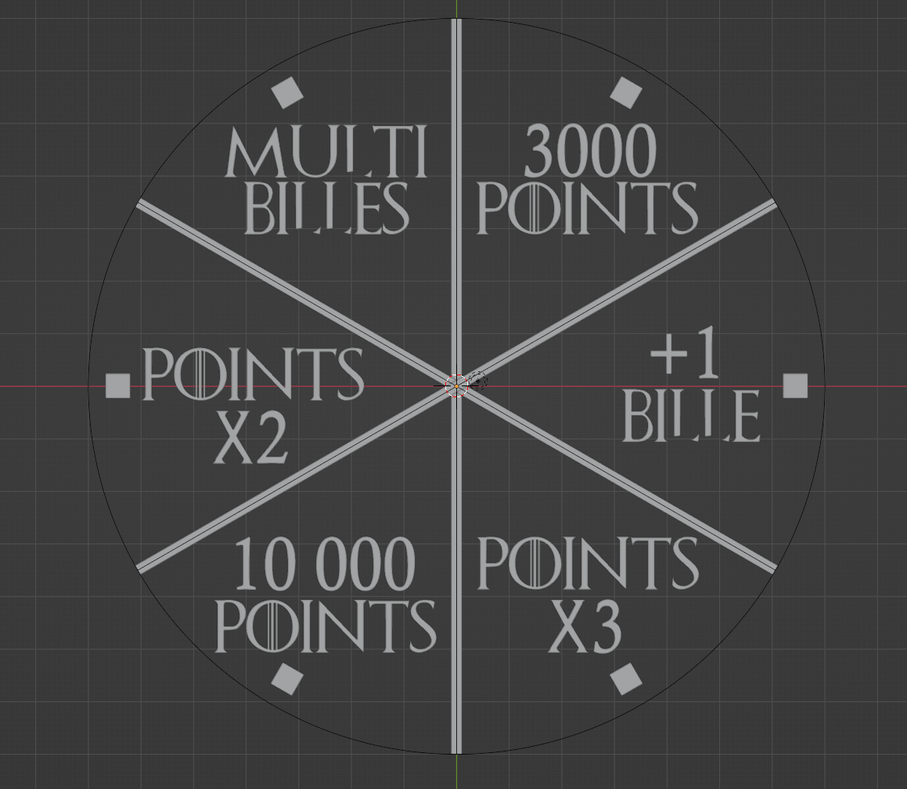
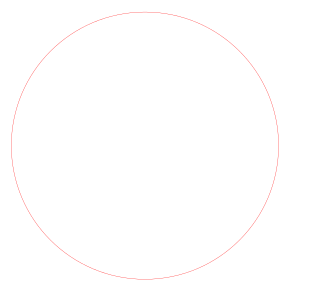
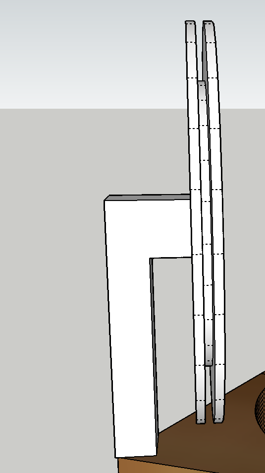

**Avant la séance :**

Nous avons finalisé la réalisation des bordures du flipper. Lors de la séance précédente nous avions déjà réalisé les bordures arrondies en transformant des modèles 3D en un fichier 2D svg utilisable avec la découpeuse laser. Pour rappel, chaque pièce devant mesurer 20mm de hauteur et la découpeuse laser étant actuellement limitée à des planches d’une épaisseur de 5mm, il a fallu coller 4 planches de 5 mm les unes sur les autres pour chaque pièce. 

Cette fois-ci nous avons découpé les pièces restantes du contour, qui sont 5 morceaux de bois coupés en ligne droite. 
Pour cela nous avons reporté les différentes mesures des contours de la maquette Sketchup sur nos morceaux de bois au crayon gris.
Sur cette capture d’écran de notre maquette on peut voir en haut à droite les pièces arrondies fabriquées à la séance précédente et en dessous les 5 morceaux de bois découpés juste avant cette séance : 

Il a fallu donc découper des morceaux de largeur 10mm de différentes longueurs et d’une hauteur de 20 mm. Puis pour des raisons de sécurité, les découpes ont été effectuées par un professeur au FabLab à la scie circulaire sur table.

Etant donné que certaines pièces arrondies ont légèrement brûlé lors de la découpe, nous avons décidé de peindre tout le contour en noir. J’ai alors appris à utiliser une bombe de peinture et retenu quelques conseils : secouer la bombe de peinture avant utilisation, commencer le mouvement avec la bombe en dehors de la surface à peindre afin d’avoir une peinture plus homogène et éviter des gouttes de peinture, purger la bombe de peinture en fin d’utilisation en la retournant et en pulvérisant pendant quelques secondes.

Voici le résultat avec toutes les pièces du contour disposées sur la planche (rien n’est encore vissé ou collé pour le moment, cela sera fait pendant la semaine des vacances) : 

Ensuite, j’ai utilisé le logiciel Fritzing afin de réaliser un schéma du câblage du Flipper afin de s’assurer de tout brancher correctement et de gagner du temps le jour du câblage. 
Pour le moment j’ai cherché et importé tous les composants dans le logiciel et les ai disposés selon leurs emplacements sur notre flipper et j’ai branché les solénoïdes aux relais. Cependant, nous nous sommes aperçus que les brancher en série risque d’engendrer une perte de puissance (3 solénoïdes pouvant être activés en même temps dans le pire des cas), il faudra alors les brancher en parallèle.

Comme chaque flipper est unique par sa décoration et ses éléments de jeu, je souhaitais intégrer un élément à notre flipper qui le distingue d’un pinball classique. J’ai alors imaginé un élément inspiré du jeu “la roue de la fortune” permettant de remporter lorsqu’elle s’active un bonus déterminé aléatoirement. 

Cette roue pourra être déclenchée par exemple lorsque toutes les cibles du jeu ont été touchées ou après que le joueur ait emprunté plusieurs rampes à la suite.

Pour fabriquer cette roue, j’utilise 6 nano pixels qui ont l’avantage d’avoir une colorimétrie RGB et d’éclairer avec une forte intensité tout en nécessitant seulement 3 fils pour tous les nano pixels. Elles vont permettre d’éclairer les différentes cases de la roue en fonction du bonus remporté. 
Je vais cependant faire face à une contrainte puisque nous n’avons pas de ruban circulaire de nano pixels, je dois donc en découper 6 du ruban, les disposer en cercle puis les relier à nouveau entre eux en y soudant des fils afin de pouvoir toujours contrôler au final les 6 nano pixels avec un seul fil (en plus des 2 fils d’alimentation).

J’ai réalisé une petite animation avec un code Arduino pour avoir le résultat suivant :
Les leds vont s’allumer et s’éteindre successivement de façon à avoir un effet de lumière qui tourne autour de la roue. Puis cette animation va s’arrêter sur une led qui va clignoter pour indiquer le bonus remporté. J’ai également rajouté un buzzer qui effectue un son à chaque fois qu’une led s’allume. Pour que les nano pixels ne soient pas éblouissants, il est préférable de mettre des valeurs comprises entre 0 et 30 dans le code couleur RGB. 
Voici le résultat en vidéo :
https://youtube.com/shorts/hx9wgBHNqKs?feature=share

J’ai choisi de réaliser un assemblage de planches de bois découpées au laser en 3 planches de 3 mm. 
La première partie est celle visible par le joueur, c’est un cercle de 140mm sur laquelle sont inscrits les bonus à remporter et elle comporte 6 trous pour y placer les nano pixels. 
La 2ème est un simple cercle de la même taille, il va me permettre d’y coller chaque nano pixel en face de son trou présent sur la première pièce. Entre ces deux pièces, toujours avec la découpeuse laser j’ai fabriqué un 3ème cercle plus petit (100mm de diamètre) qui sera collé entre les deux et permettra de laisser la place pour passer les câbles reliant les 6 nano pixels en série.
Le tout sera fixé sur le rebord haut du flipper grâce à un support imprimé en 3D dans lequel je réaliserai un trou pour y passer les 3 câbles de branchement.

**Pendant la séance :**

Cette séance m’a permis de créer les pièces de bois de la roue de la fortune. 
Pour cela j’ai commencé par effectuer une esquisse sur papier pour déterminer le nombre de cases de la roue, l’emplacement des leds et les bonus que j’y inscrirai (j’ai donc cherché le mode de comptabilisation de points d’un vrai flipper, pour avoir un mode de fonctionnement qui s’en rapproche et donc octroyer des bonus cohérent avec le reste du jeu).

Voici les bonus choisis : 
Multi-Billes : déclenche un élément sur le plateau qui va relâcher 3 autres billes simultanément permettant au joueur de jouer avec plusieurs billes à la fois et donc de marquer plus de points.
Points x2 / Points x3 : bonus multipliant les nouveaux points gagnés par le joueur par 2 ou 3 pendant un certain temps (le bonus sera par exemple désactivé au bout de 30 secondes).
3 000 points / 10 000 points : ajoute 3000 ou 10 000 points au score du joueur. Il sera possible dans le code de réduire la probabilité que l’on tombe sur la case 10 000 pour conserver la rareté de ce bonus important.
+1 bille : rajoute un essai au joueur en lui offrant une bille supplémentaire qu’il pourra lancer depuis la zone de lancement une fois que les autres billes auront été perdues.

J’ai pour cela utilisé le logiciel Blender afin d’être plus efficace puisque je le maitrise bien mieux que Inkscape. Les cases sont séparées avec un angle de 60° par des rectangles de 2 mm de largeur. J’ai placé 6 carrés de côté 20 mm qui permettront de laisser passer les nano pixels.

Pour ce qui est du texte j’ai utilisé une police d’écriture liée au thème du flipper. J’ai ensuite utilisé une extension nommée ‘freestyle svg export’ activable directement dans les paramètres du logiciel. Celle-ci permet d’exporter les contours d’un modèle 3D selon une vue en vecteurs dans un fichier svg. Pour l’utiliser il suffit de placer une caméra de rendu dans la vue désirée puis de lancer un rendu image avec l’extension activée.
Finalement dans inkscape, après avoir corrigé quelques erreurs d’exportation en svg avec l’aide de Redha Abderrahmane, j’ai ajouté un remplissage de couleur noir à l’intérieur des lettres puis des dessins vectoriels trouvés sur internet sur chaque case.

Et le résultat final après découpe et gravure au laser:

Puis j’ai mis à jour la maquette sketchup en y ajoutant la roue de fortune avec l’image svg créée pour m’assurer du résultat : 

Finalement j’ai commencé à réfléchir à un support qui viendra se visser avec le reste des éléments sur la roue pour la fixer au-dessus d’un rebord du flipper.
Il me reste à faire la modélisation de la pièce finale au propre.

