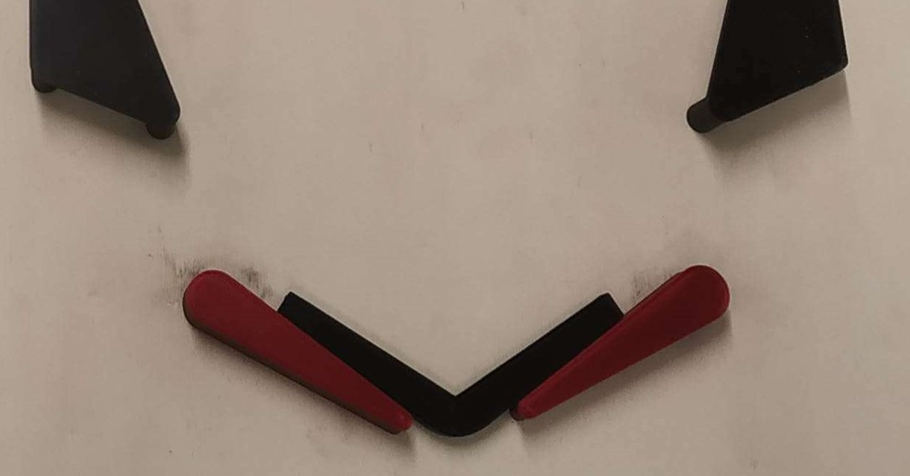
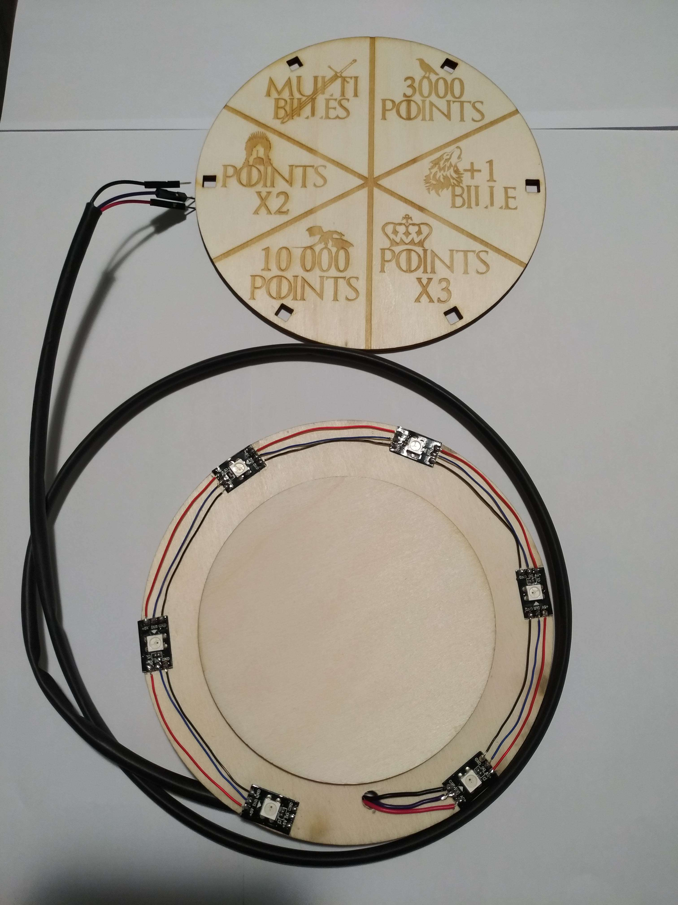
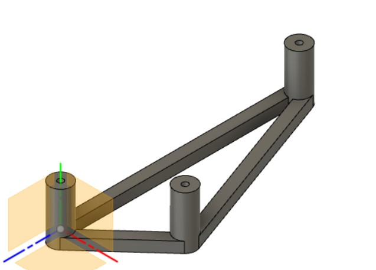
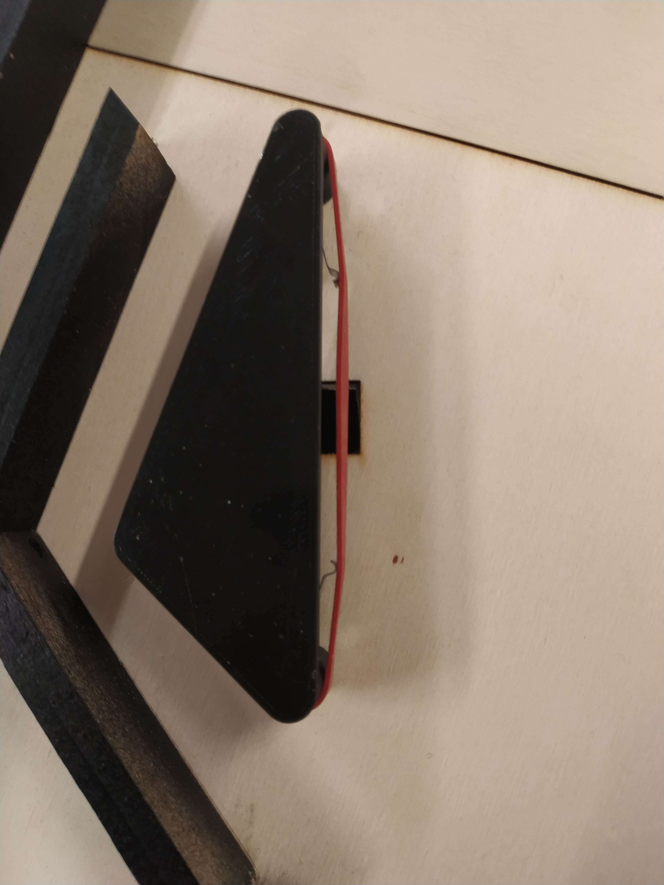
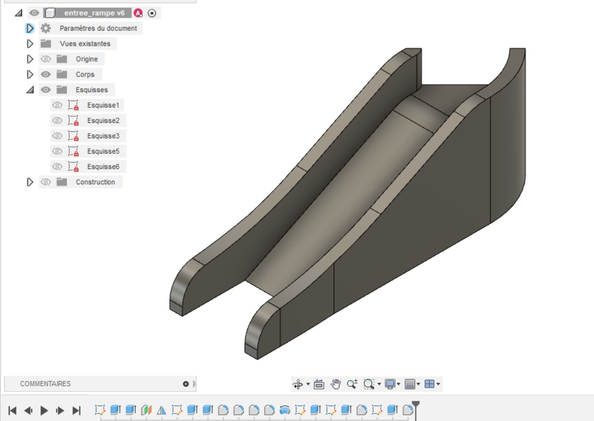
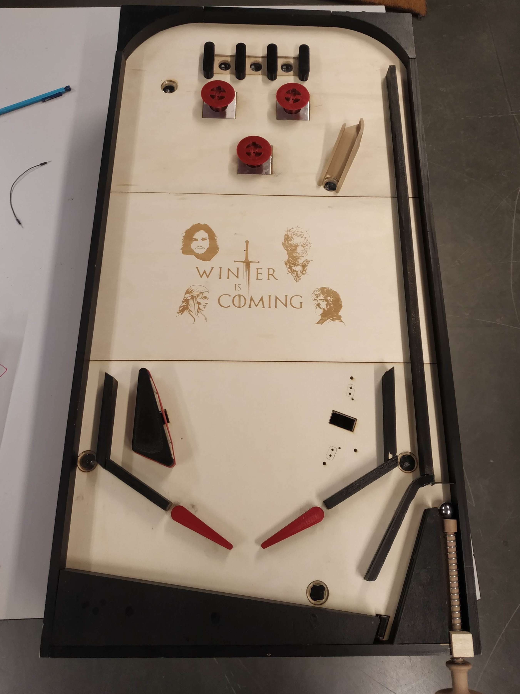

**Avant la séance :**

Lors de la séance précédente nous avions préparé nos planches finales et toutes les bordures du flipper. Nous avons profité des vacances pour passer quelques jours au Fablab afin d’assembler notre flipper. 
Pour cela avec l’aide de Frédéric Juan du Fablab nous avons commencé par coller les 3 fines planches (découpées au laser) sur la grande planche de jeu afin d’avoir l’emplacement de tous les trous à percer. Puis nous avons vissé toutes les bordures du flipper.

Pour déterminer l’inclinaison optimale de notre pinball nous avons utilisé un inclinomètre numérique. La plupart des pinball ont une inclinaison comprise entre 3° et 6°, après avoir testé différentes inclinaisons avec des cales de bois, nous avons choisi une inclinaison de 4°. J’ai ensuite mesuré et dessiné au crayon le support permettant d'incliner le pinball sur des morceaux de bois afin de les découper.

Il a fallu également effectuer un trou dans la bordure inférieure pour y insérer la poignée (modélisée en 3d avec un filetage pour pouvoir la démonter afin de l’insérer dans le trou). Cependant étant donné la force exercée par le ressort sur la bordure il a fallu la renforcer par un morceau de bois plus haut à cet endroit.

Pour ramener la bille dans la zone de lancement lorsqu’elle est perdue par le joueur, nous avons vissé un solénoïde sous la planche grâce à une équerre et attaché à celui- ci un bras imprimé en 3D que j’ai modélisé. Ainsi lorsque celui-ci s'activera (donc quand la bille sera détectée par un capteur infrarouge de sortie de jeu), le bras du solénoïde poussera la bille pour l’envoyer au-dessus de la tige de la poignée de lancement. 

Voici le test de toute la zone de lancement en vidéo  :

https://youtu.be/IZiwfpQI0ls

Avant d’aller au Fablab, j’avais préalablement imprimé en 3D toutes les pièces modélisées, testées et ajustées lors des séances précédentes afin d’avoir tout le nécessaire pour l’assemblage de notre pinball. 
J’ai notamment dû modifier l’épaisseur de la surface supérieure des tendeurs à élastiques des slingshots (pièces renvoyant la bille dans la direction opposée) car les pièces se courbaient en raison de la force de tension exercée par l’élastique  sur celles ci.
Il a fallu limer certaines pièces afin de s’assurer que la mécanique des pièces en mouvement (bumpers, flippers et slingshots) s’effectue sans trop de frottements. J’ai également taraudé de nombreuses pièces imprimées pour pouvoir les fixer directement en vissant dans du plastique. 

Il a fallu plusieurs heures pour régler les flippers (pièces frappant la balle contrôlées par le joueur) avec la bonne inclinaison sans bloquer le mouvement des solénoïdes qui les contrôlent. En effet, ceux-ci doivent être parfaitement disposés pour que le mouvement de rotation puisse s’effectuer correctement sans trop de frottements. Pour cela j’ai imprimé une pièce donnant l’inclinaison utilisée dans la plupart des pinball (pièce noire sur photo ci dessous). Après de nombreux réglages il y restait des blocages dans le mécanisme, j’ai donc dû limer les pièces plastiques afin de rajouter du jeu mécanique pour que les mouvements soient moins contraints.

Une fois toutes les pièces plastiques fixées, nous avons calibré la sensibilité de nos capteurs infrarouges grâce aux vis de réglages situées sur ceux-ci. 
Puis je les ai vissé sous la planche. Il a fallu les positionner de façon à ce que les leds émettrices et réceptrices soient très proche de la plaque de plexiglass afin que lorsque la bille roule sur celle-ci, elle soit bien détectée. J’ai modélisé un support à la bonne hauteur sur lequel j’ai ajouté 3 trous pour que les résistances et les leds du circuit intégré du capteur s’emboîtent à l’intérieur sans être endommagées. Voici la pièce modélisée : 

Précédemment j’avais également fabriqué par découpe et gravure laser un élément propre à notre flipper : la roue de la fortune.”  Cet élément du jeu permet de gagner un bonus au hasard indiqué par le clignotement d’une led associée au bonus en question. J’ai du alors découper un ruban de néo pixels afin de les disposer de façon circulaire dans les trous prévus et ensuite ressouder tous les néo pixels entre eux afin de pouvoir toujours les alimenter et contrôler avec seulement 3 fils.

Une autre étape très délicate dans l’assemblage de nos pièces était de fixer les micro interrupteurs permettant de détecter un impact sur l’élastique des slingshot. En effet, cela nécessite une très grande sensibilité. Tout d’abord j’ai testé plusieurs marques de microswitch afin de choisir les plus sensibles possibles, une fois ce choix effectué, étant donné que sur un même composant il y a des différences de fabrication j’en ai testé une vingtaine afin de sélectionner ceux qui se déclenchent avec le moins de force possible. 
Ensuite il a fallu les placer sous les slingshots. Comme constaté lors de la réalisation des prototypes, ils doivent être positionnés de façon à ce que la lamelle subisse une pression initiale exercée par l’élastique afin qu’ils se déclenchent au moindre contact mais en faisant attention à ce que celui-ci ne reste pas bloqué en position enfoncée. La pièce du slingshot ne permettant pas de régler facilement la position de ceux-ci, j’ai décidé de créer une copie de celle-ci en ajoutant un trou à l’intérieur afin de pouvoir y passer des doigts pour placer l’interrupteur. Cette pièce étant utilisée uniquement le temps de déterminer l’emplacement des interrupteurs.

Pour les fixer j’ai modélisé et imprimé 4 supports permettant de les surélever à la bonne hauteur. Une fois la position optimale déterminée j’ai tracé le contour de ceux-ci sur la planche au crayon pour perçer des trous permettant de les visser.

Durant le temps restant avant la séance j’ai réfléchi au câblage des composants électroniques en continuant et en adaptant le schéma électronique commencé à la séance précédente sur le logiciel Fritzing. J’ai ensuite fixé les différents composants sous la planche et j’ai câblé le convertisseur entre le connecteur d’alimentation et l’arduino (après l’avoir réglé avec un multimètre pour qu’il transforme la tension de 24V en une tension de 5V en sortie).

Finalement j’ai modélisé en 3D l'entrée de la rampe. J’ai effectué différents tests pour déterminer l’inclinaison de celle-ci afin que la bille ait assez de vitesse pour monter en haut de celle-ci. Il restera à courber du fil électrique pour effectuer la suite de la rampe sur laquelle la bille va rouler. Étant donné que le capteur infrarouge permettant de comptabiliser un passage dans la rampe dans le score est à l’entrée de la rampe, il risque d’être déclenché lors d’un simple passage devant celle-ci. J’ai donc ajouté à la rampe 2 barrières d’une longueur de 20 mm afin d’éviter de comptabiliser par erreur un passage dans la rampe. 
De plus, si la bille repasse devant le capteur infrarouge un très bref instant après le premier passage, cela signifie que le joueur n’a pas réussi à l’envoyer en haut de la rampe et donc on n’ajoutera pas de points.

Voici l’avancée du pinball avant la séance : 

**Pendant la séance :**

Étant donné le peu de temps restant avant la date de présentation finale puisque tous les composants principaux maintenant fixés fonctionnent correctement mécaniquement, nous avons décidé de se consacrer pleinement en équipe au câblage des composants afin d’être sûr de pouvoir présenter une version fonctionnelle. Pour cela nous avons commencé par câbler tous les solénoïdes en parallèle afin d’avoir la même tension pour chaque solénoïde. 
Pour relier toutes les masses des solénoïdes entre elles nous avons utilisé 2 connecteurs wago à leviers. Un pour le haut du flipper et un pour le bas du flipper ,les deux étant reliés par un câble afin d’avoir une masse commune. 

Cela permet d’éviter de perdre du temps à effectuer des soudures et de pouvoir facilement débrancher un fil en cas de problème.

L’autre fil de chaque solénoïde est branché à un relais sur la broche Normally Open qui est alimenté par l’arduino et reçoit en sortie du 24V via l’alimentation.

Nous avons écrit un petit programme activant 3 solénoïdes en simultané afin de vérifier que tout fonctionne correctement. 
Puis j’ai écrit un autre code pour activer un solénoïde un par un toutes les secondes pour vérifier qu’ils fonctionnent tous. 
Nous nous sommes alors aperçu que 2 solénoïdes ne fonctionnaient pas correctement. Nous devons donc encore vérifier les soudures et le branchement de ceux-ci.
Finalement j’ai commencé à ajouter des attaches câbles afin de regrouper les fils passant au même endroit pour avoir un câblage plus ordonné et donc de pouvoir nous y retrouver plus facilement.

Voici le dessous de la planche avec le câblage en cours d’installation (il reste encore de nombreux fils à brancher et à mieux ordonner les câbles)

**Étapes finales à réaliser :**

- Il nous reste désormais à terminer le câblage en branchant nos 8 capteurs infrarouges, les 2 boutons des flippers, les 4 microswitch des slingshots + 3 pour les cibles, l’écran, la roue de la fortune et un ruban neopixel de décoration. 

- Coller les cibles sur les microswitch et les assembler sur le support puis les fixer sur la planche.

- Modifier l’inclinaison de la bordure inférieure ramenant la bille en zone de lancement.

- Fixer l’écran et la roue de la fortune sur le flipper

- Finaliser la partie programmation, nous avions déjà réalisé des programmes pour tester chaque composant indépendamment, il faut désormais réaliser le programme complet permettant d’automatiser le fonctionnement d’une partie.

- Finir la fabrication de la rampe et la placer sur le flipper.

- Finitions et correction d’éventuels bugs
